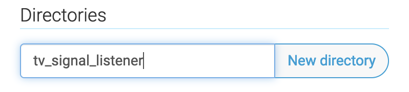
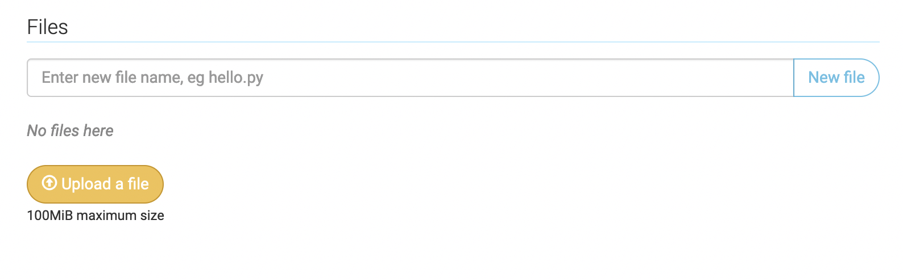
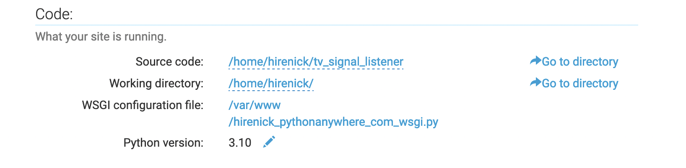
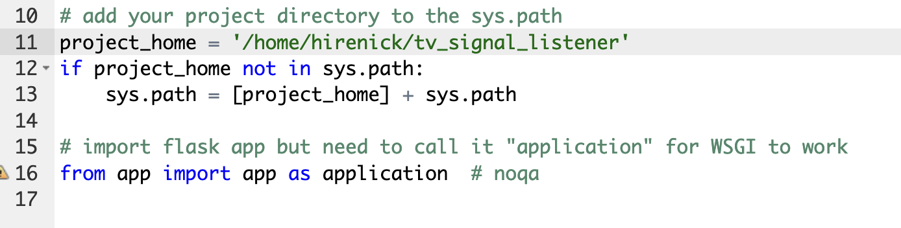
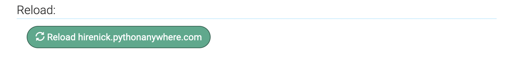
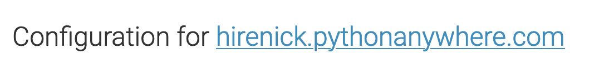
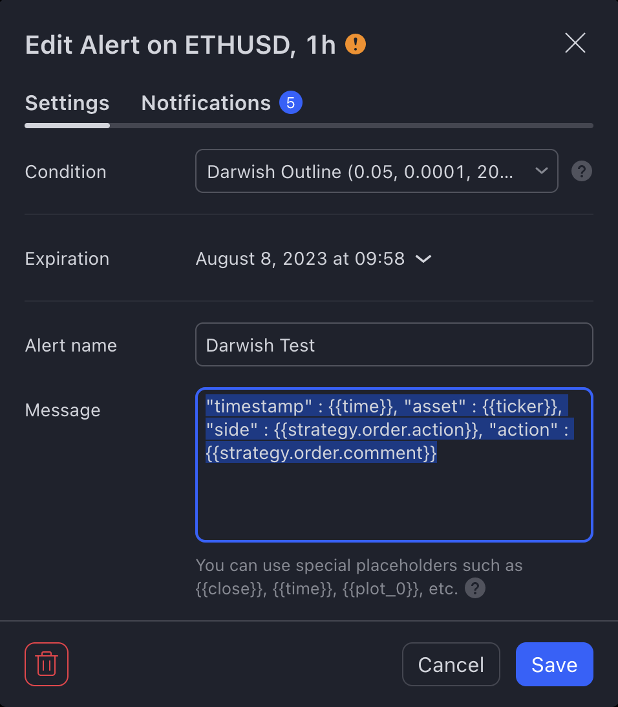
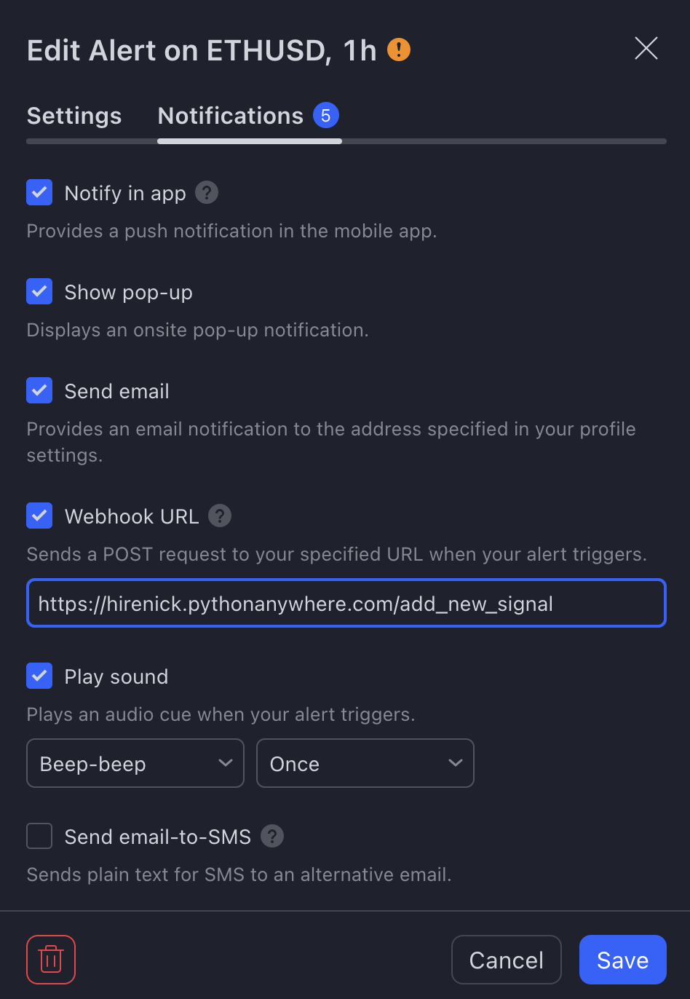
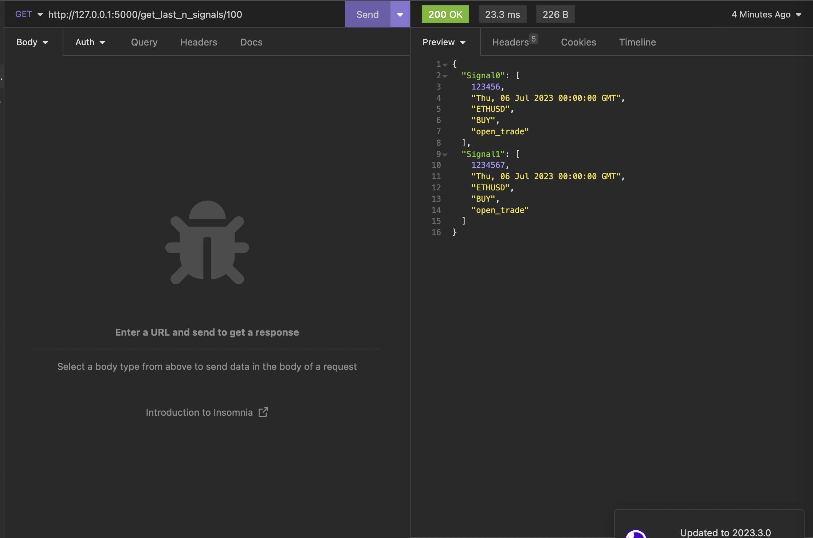
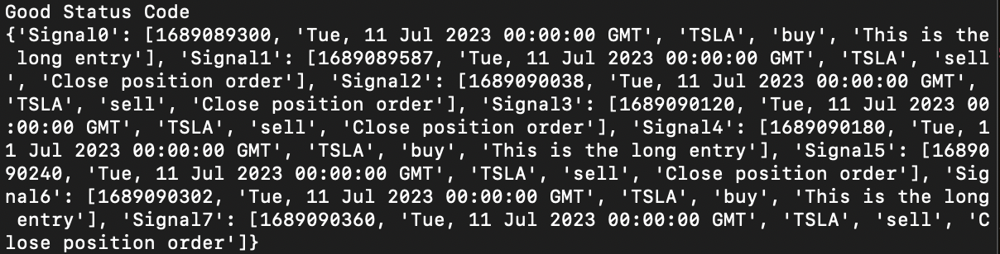

<h1>TradingView Signal Listener Setup</h1>
<h3>What It Does</h3>
This is a flask app hosted on the free tier of pythonanywhere.com.  It acts as an API that both processes and serves signals forwarded from TradingView strategies.

<h2>PythonAnywhere Setup</h2>
Go to your pythonanywhere dashboard.  Then navigate to the 'files' page.
Under the 'directories' label enter the name of the project folder.  In this instance, I'm going to call it 'tv_signal_listener'.  Click 'new directory' to create the folder.



Once the directory is created, you'll be redirected to that path.  Now you can start uploading files to the project directory.



Upload both the 'app.py' file and the 'requirements.txt' files to the directory.

Navigate to the 'consoles' link at the top of the webpage.


If you don't already have a console and you are given the option of creating one, just choose 'bash'.  CD into your project directory by running ```cd tv_signal_listener``` or whatever you called the directory.  Then run ```pip install -r requirements.txt``` to install all of the project dependencies.

Once you've installed the dependencies, you then need to initialize the database so that it can start having data written to it.  So staying in the same bash terminal that you have up, run ```flask shell``` to start the flask shell.  Then run ```from app import db``` followed by ```db.create_all()```.  Run ```exit()``` to exit the flask shell and then ```exit``` to close the console.

Navigate to the 'Web' link up by where you previously selected the 'consoles' link.  Make sure that the source code path points to your web directory.  And then open up your WSGI configuration file.



Make sure that the __project_home__ variable is set to your project's path.



Save this config file and then return to the 'Web' page.  Click on the 'Reload' button near the top of the 'Web' page to refresh your site.



Then click on the link above to visit the hosted site.



You should get the 'Welcome Darwish!' message if everything was setup correctly.  You're now ready to setup the TradingView webhooks.


<h3>TradingView Webhooks Setup</h3>

Navigate to your TradingView chart / setup where you have the 'outline' (aka the tradingview strategy we've been working on) script setup.  Create a new alert and make sure that the outline script is selected for the 'condition'.  Give the alert a name and then for the JSON payload copy/paste this block ```{"timestamp" : "{{time}}", "asset" : "{{ticker}}", "side" : "{{strategy.order.action}}", "action" : "{{strategy.order.comment}}"}```



Then navigate over to the 'Notifications' tab.  Go down and click the option for 'Webhook URL' and put in the <path_to_your_website>/add_new_signal.  Mine looks like this...



Click on 'Save'.  Your strategy signals are now posted to this url where they are processed and added to a database / API you can query.

<h3>Checking For New Signals</h3>

And then in order to query the last n results (up to 25 at a time) send a 'GET' request to your web app's url + 'get_last_n_signals/<number_of_signals_you_want_to_fetch>.



Sample code for calling this endpoint is also provided in the file __test_call_api.py__.  Here's the output...

